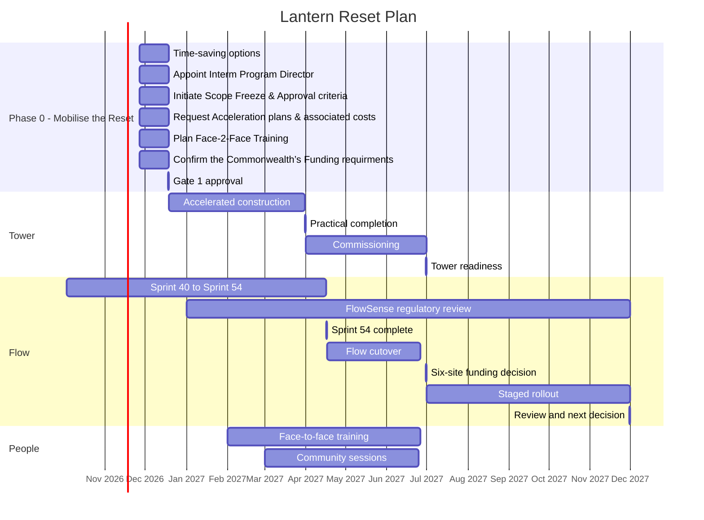

```mermaid
gantt
    title Lantern Reset Plan
    dateFormat YYYY-MM-DD
    axisFormat %b %Y

    section Phase 0 - Mobilise the Reset
    Time-saving options :p0, 2026-11-27, 22d
    Appoint Interm Program Director    :g1, 2026-11-27, 22d
    Initiate Scope Freeze & Approval criteria    :g1, 2026-11-27, 22d
    Request Acceleration plans & associated costs    :g1, 2026-11-27, 22d
    Plan Face-2-Face Training    :g1, 2026-11-27, 22d
    Confirm the Commonwealth’s Funding requirments    :g1, 2026-11-27, 22d
    Gate 1 approval :g1, 2026-12-18, 1d

    section Tower
    Accelerated construction :tower, 2026-12-19, 102d
    Practical completion :g2, 2027-03-31, 1d
    Commissioning :commission, 2027-04-01, 91d
    Tower readiness :g3, 2027-06-30, 1d

    section Flow
    Sprint 40 to Sprint 54 :sprints, 2026-10-03, 195d
    FlowSense regulatory review :review, 2027-01-01, 334d
    Sprint 54 complete :g4, 2027-04-16, 1d
    Flow cutover :cutover, 2027-04-17, 70d
    Six-site funding decision :g5, 2027-06-30, 1d
    Staged rollout :rollout, 2027-07-01, 153d
    Review and next decision :g6, 2027-11-30, 1d

    section People
    Face-to-face training :training, 2027-02-01, 145d
    Community sessions :community, 2027-03-01, 116d
```
